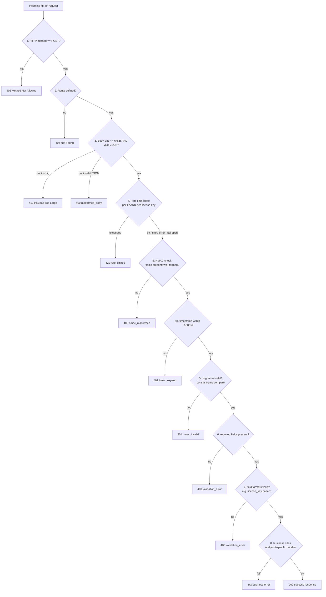
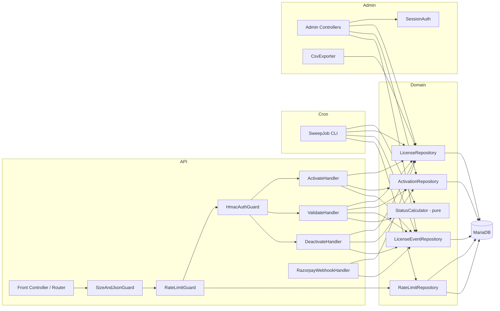

# Design Document

## Overview

The License Validation Server is a framework-less PHP 8.2+ application deployed as PHP-FPM under OpenLiteSpeed on a self-managed OVH VPS (provisioned via ServerAvatar), backed by a local-only MariaDB instance, and expected to sit behind Cloudflare. It has two front doors:

- A signed **JSON API** (`/activate`, `/validate`, `/deactivate`, `/webhook/razorpay`) consumed by the Serenity Booking WordPress plugin and by Razorpay.
- A session-authenticated **Admin Panel** (server-rendered PHP pages) for the single operator.

A third, headless entry point is the **Sweep_Job**, a PHP CLI script triggered hourly by a server cron entry, which performs bulk grace/expiry transitions.

Because this is a solo-developer codebase, the design deliberately avoids a framework, a DI container, an ORM, and unnecessary abstraction layers. It uses:

- Plain PHP files with `require`/autoloading via Composer's PSR-4 autoloader (Composer is used only for autoloading and the property-based testing / PHPUnit dev dependencies, not as an application framework).
- PDO with prepared statements for all MariaDB access, wrapped in small, explicit repository classes (one per table) rather than a generic data-mapper.
- A tiny hand-rolled front controller / router for the API (a `match()`-based dispatch, not a routing library).
- Native PHP sessions for admin auth.

The one deliberate shared abstraction — because it is load-bearing for correctness, not convenience — is a single **`StatusCalculator`** pure function used by both the Sweep_Job and the Lazy_Check code path in `/validate`. This is what guarantees the two mechanisms can never disagree (see Requirement 5, 11, 12 and the Correctness Properties section).

### Provisional API field names

Per the requirements' open item, the exact JSON field names below are **provisional** and must be cross-checked against the existing WordPress client scaffold (`class-serb-license.php`, `serenity-license-manager` wrapper plugin) before being treated as final/frozen. The design isolates all field-name literals in one place (`Api\Contract\FieldNames` constants used by the request DTOs and response builders) specifically so that renaming them later, once the real client is checked, is a one-file change rather than a scattered find-and-replace.

Provisional request/response field names used throughout this document:

| Endpoint | Request fields (provisional) | Response fields (provisional) |
|---|---|---|
| `/activate` | `license_key`, `site_url` | `status`, `expires_at` |
| `/validate` | `license_key`, `site_hash` | `status`, `expires_at` |
| `/deactivate` | `license_key`, `site_hash` | `slots_available` |
| `/webhook/razorpay` | (Razorpay's own payload shape, not ours) | `ok` (boolean) |
| all errors | — | `error_code`, `message` |

All HMAC and rate-limit headers (`X-Serb-Timestamp`, `X-Serb-Signature`) are likewise provisional names pending the same cross-check.

## Architecture

### Request lifecycle (API)

Every API request passes through a fixed pipeline. The stage order below is a hard requirement (Requirement 20 AC8) and is implemented as an ordered array of pipeline steps in the front controller, not as scattered `if` checks, so the order is enforced structurally rather than by convention.



The webhook route (`/webhook/razorpay`) reuses stages 1-3 but replaces stage 4 (rate limiting) and stage 5 (HMAC) with Razorpay's own webhook signature check, since Requirement 7 defines its own auth scheme; rate limiting does not apply to the webhook endpoint (it is not enumerated in Requirement 9).

### Component overview



### File / module structure

```
/config
    config.php              # loads and validates env vars, returns immutable array/object
/public
    index.php                # API front controller (single entry point for API)
    admin/index.php          # Admin panel front controller
/src
    Config/
        Config.php
        ConfigException.php
    Http/
        Router.php
        Request.php
        Response.php
        JsonBodyGuard.php     # stages 1-3: method, route, size/JSON
        ErrorResponder.php    # builds the uniform {error_code, message} shape
    Security/
        HmacAuthenticator.php
        ClientIpResolver.php
        TrustedProxyRanges.php
    RateLimit/
        RateLimiter.php        # sliding window logic, scope-parameterized
        RateLimitRepository.php
    Domain/
        License.php            # plain value object / row hydration
        Activation.php
        LicenseEvent.php
        StatusCalculator.php    # pure function shared by Lazy_Check + SweepJob
        LicenseKeyGenerator.php
    Repository/
        LicenseRepository.php
        ActivationRepository.php
        LicenseEventRepository.php
        AdminUserRepository.php
        Db.php                  # thin PDO factory/wrapper
    Api/
        ActivateHandler.php
        ValidateHandler.php
        DeactivateHandler.php
        RazorpayWebhookHandler.php
        FieldNames.php           # provisional JSON field name constants
    Cron/
        SweepJob.php
        SweepLock.php            # file/DB advisory lock, prevents overlap
    Admin/
        SessionAuth.php
        LoginController.php
        DashboardController.php
        LicenseListController.php
        LicenseDetailController.php
        LicenseActionController.php
        ManualIssuanceController.php
        CsvExportController.php
    Audit/
        AuditLogger.php          # wraps LicenseEventRepository, swallows secondary failures
    Support/
        Clock.php                 # injectable "now" for testability
        Logger.php                 # file/error_log wrapper with secret-redaction
        ErrorContext.php           # builds detailed, consistent "what/why/where" log strings
/templates                       # plain PHP admin view templates (no template engine)
/migrations                       # plain .sql files, applied manually / via a tiny runner
/tests
    Unit/
    Property/
.env.example
.gitignore
composer.json
```

`Clock` is injected wherever "current time" matters (HMAC timestamp check, rate limiting, StatusCalculator, session expiry, lockout) so tests can control time deterministically without sleeping.

### Cron and locking

The Sweep_Job is invoked by a server crontab entry (`*/60 * * * * php /path/to/src/Cron/SweepJob.php`, wired via ServerAvatar's cron UI). `SweepLock` acquires a MySQL advisory lock (`GET_LOCK('serb_sweep_job', 0)`) at the very start of the run; if the lock is already held, the run exits immediately performing zero transitions, satisfying Requirement 12 AC8 without needing a separate PID file (a DB-level lock survives VPS reboots better than a lock file and works even if the process was killed uncleanly, since `GET_LOCK` is released automatically when the holding connection closes).

## Components and Interfaces

### Config (`Config\Config`)
- `Config::load(): Config` reads `.env` (via a tiny parser, no third-party dependency needed — dotenv parsing is ~20 lines) merged with real environment variables, validates every key required by Requirement 21 AC1 is present and non-empty, and throws `ConfigException` otherwise.
- Keys: `DB_HOST`, `DB_NAME`, `DB_USER`, `DB_PASS`, `RAZORPAY_KEY_ID`, `RAZORPAY_WEBHOOK_SECRET`, `HMAC_SHARED_SECRET`, `TRUSTED_PROXY_RANGES` (comma-separated CIDR list), `RATE_LIMIT_IP_MAX`, `RATE_LIMIT_IP_WINDOW_SECONDS`, `RATE_LIMIT_KEY_MAX`, `RATE_LIMIT_KEY_WINDOW_SECONDS`, `SESSION_SECRET`.
- The front controller catches `ConfigException` at the top level, logs only the missing key name (never other config values), and returns a 500 structured error (Requirement 21 AC4).

### HmacAuthenticator (`Security\HmacAuthenticator`)
- `verify(Request $r, string $secret, Clock $clock): Result` — implements the fixed 3-step order from Requirement 3 AC7: (1) field presence/format, (2) timestamp expiry (±300s via `Clock::now()`), (3) `hash_equals()` constant-time signature comparison over `"{timestamp}.{rawBody}"` with HMAC-SHA256.
- Never logs or returns the secret; only returns an enum-like `Result` (`ok`, `malformed`, `expired`, `invalid_signature`).

### ClientIpResolver (`Security\ClientIpResolver`, `Security\TrustedProxyRanges`)
- `resolve(array $serverVars, TrustedProxyRanges $ranges): string` implements the Requirement 8 decision tree: trusted `REMOTE_ADDR` → prefer `CF-Connecting-IP`, else rightmost `X-Forwarded-For` entry, else fall back to `REMOTE_ADDR`; untrusted or unparseable-ranges-config → always `REMOTE_ADDR`; any syntactically invalid header value → fall back to `REMOTE_ADDR`.
- `TrustedProxyRanges::fromConfig(string $csv): self` parses CIDR ranges from config; an empty/missing/unparseable value yields an empty range set, which causes `resolve()` to always take the fail-closed (`REMOTE_ADDR`-only) branch.

### RateLimiter (`RateLimit\RateLimiter`, `RateLimit\RateLimitRepository`)
- `RateLimitRepository::record(string $scope, string $scopeValue, string $endpoint, int $timestamp): void` inserts one row; catches its own PDO exceptions internally, logs, and returns normally (never throws) so a write failure cannot abort the request (Requirement 2 AC3).
- `RateLimitRepository::countSince(string $scope, string $scopeValue, int $since): int` throws a dedicated `RateLimitStoreException` on read failure rather than silently returning 0, so the caller can distinguish "0 requests" from "couldn't tell" and fail open correctly.
- `RateLimiter::check(string $ip, ?string $licenseKey, int $now): RateLimitDecision` evaluates the per-IP check and (when a license key is present) the per-license-key check independently; a store exception on one scope is caught, logged, and treated as "not exceeded" for that scope alone, while the other scope's result (if successfully evaluated) still applies. The request is rejected only if a successfully-evaluated scope reports the configured limit met or exceeded.
- `RateLimitRepository::cleanup(int $maxWindowSeconds, int $now): void` deletes rows with `created_at < now - maxWindowSeconds`; failures are caught and logged by the caller (the Sweep_Job), never thrown out of the cron run.

### StatusCalculator (`Domain\StatusCalculator`)

This is the single most important shared component. It is a pure function with no side effects and no DB access:

```php
final class StatusComputation {
    public function __construct(
        public readonly string $status,           // active|grace|expired (never touches lifetime/revoked)
        public readonly bool $changed,             // true if != stored status
        public readonly ?int $graceStartTimestamp, // set only on active->grace transition, else null
    ) {}
}

final class StatusCalculator {
    // $license must be tier=annual and status in {active, grace}; callers filter lifetime/revoked out beforehand.
    public static function compute(License $license, int $now): StatusComputation { ... }
}
```

Logic: if `status === 'active'` and `expires_at !== null` and `expires_at <= now`, the computed status is `grace` with `graceStartTimestamp = now` (only when no grace-start is already persisted — see the persistence rule below). If `status === 'grace'` and `now - grace_start_at >= 259200`, computed status is `expired`. Otherwise the computed status equals the stored status (no change).

Both the Sweep_Job and the `/validate` Lazy_Check call `StatusCalculator::compute()` with the same `$now` semantics and the same input `License` row, then apply the **same persistence rule**: if `changed === true`, persist the new status (and `graceStartTimestamp` if non-null) to the `licenses` row, append the corresponding event (`sweep_grace_transition` / `sweep_expiry_transition` from the Sweep_Job, `silent_lapse_grace` from either mechanism when detecting a fresh silent lapse, or nothing extra beyond the status field when transitioning grace→expired) inside the same request/run, and only *then* build the response/continue the run. Because both call sites route through the identical function and persistence rule, they are structurally guaranteed to converge — this is the design's answer to Requirement 5 AC6 (Lazy_Check never more favorable than Sweep_Job) and Requirement 11 AC2 (grace-start never overwritten): grace-start is only ever set when transitioning *from* `active`, i.e. exactly once per lapse, by whichever caller gets there first (the persistence write uses `UPDATE ... WHERE status = 'active'` as an optimistic guard so a race between the Sweep_Job and a concurrent `/validate` call cannot double-set it).

### Repositories (`Repository\*`)

Thin classes over PDO prepared statements, one per table, each exposing only the operations the domain needs (no generic `save()`/`delete()` on `LicenseEventRepository` — only `append()` — which is what makes the append-only rule structurally true rather than a convention). `LicenseRepository` exposes `findByKey`, `findById`, `create`, `updateFields` (a targeted field-list update, never a full-row overwrite, so unrelated fields can't be clobbered by a stale read), and query helpers for the admin list/dashboard (`search`, `filter`, `countBy...`, `expiringWithin`, etc.) built with parameterized `WHERE` fragments assembled from an allow-list of filter keys (never raw user input concatenated into SQL).

### Api handlers (`Api\ActivateHandler`, `ValidateHandler`, `DeactivateHandler`, `RazorpayWebhookHandler`)

Each handler implements only stage 6-8 of the pipeline (required fields, field format, business rules) — stages 1-5 already ran in the front controller. Each returns a `Response` built via `ErrorResponder`/a success builder, never talking to `$_SERVER`/echoing directly, so handlers are unit-testable with plain arrays in and a `Response` object out.

`RazorpayWebhookHandler` additionally: verifies Razorpay's own `X-Razorpay-Signature` header (HMAC-SHA256 over the raw body with `RAZORPAY_WEBHOOK_SECRET`, constant-time compare); checks the event's `id` field against a lookup of previously-recorded event ids (queried from `license_events.payload` via a generated/stored column — see Data Models — to keep the idempotency check an indexed lookup rather than a JSON scan) for idempotent replay detection; dispatches on `event.type` to per-type effect logic; always appends exactly one `license_events` row per accepted webhook request.

### SweepJob (`Cron\SweepJob`)

Iterates annual, non-revoked Licenses in pages (to bound memory on large tables), calling `StatusCalculator::compute()` per row inside a per-row `try/catch` so one row's failure (e.g. a transient DB error persisting that row's transition) is logged, recorded as a `sweep_error` event where possible, and does not stop the loop (Requirement 12 AC7). After the main loop it calls `RateLimitRepository::cleanup()`, itself wrapped in `try/catch` so a cleanup failure is logged and does not fail the run (Requirement 2 AC6).

### Admin (`Admin\*`)

`SessionAuth::requireAuthenticated()` is called at the top of every protected controller; it checks `$_SESSION['admin_user_id']` and `$_SESSION['last_activity']` against the 30-minute inactivity window (via `Clock`), redirecting to the login page otherwise and touching `last_activity` on every successful check. `LoginController` implements the lockout counter (5 failures / 15 minutes / username-scoped) using a small `admin_login_attempts` table (see Data Models) rather than session state, since lockout must survive across the attacker's own fresh sessions. `LicenseListController` builds one parameterized query per request from an allow-list of filters + search + expiring-window + page, reused verbatim by `CsvExportController` so list and export can never disagree about what "the current filters" match (Requirement 16 AC2/AC3's consistency guarantee comes directly from sharing this query-builder).

### AuditLogger (`Audit\AuditLogger`)

Every state-changing code path (activation, deactivation, webhook effect, admin action, sweep transition) calls `AuditLogger::record(licenseId, eventType, payload)` *after* the primary state mutation has been committed, wrapped so that any exception from `LicenseEventRepository::append()` is caught, an attempt is made to log it via `Support\Logger`, and execution continues normally — the caller never sees an exception from this call (Requirement 22 AC4).

## Data Models

All tables use InnoDB, `utf8mb4`, and `BIGINT UNSIGNED AUTO_INCREMENT` primary keys unless noted. Timestamps are `DATETIME` (UTC) except where a Unix-epoch integer is explicitly required by the API contract.

```sql
CREATE TABLE licenses (
    id                       BIGINT UNSIGNED AUTO_INCREMENT PRIMARY KEY,
    license_key              VARCHAR(29)     NOT NULL,   -- SERB-XXXXX-XXXXX-XXXXX-XXXXX
    email                    VARCHAR(255)    NOT NULL,
    customer_name            VARCHAR(255)    NOT NULL,
    product                  VARCHAR(100)    NOT NULL,   -- opaque; no code branches on specific values
    tier                     ENUM('annual','lifetime') NOT NULL,
    status                   ENUM('active','grace','expired','revoked') NOT NULL DEFAULT 'active',
    purchased_at             DATETIME        NOT NULL,
    expires_at               DATETIME        NULL,
    grace_start_at           DATETIME        NULL,        -- persisted grace-start anchor (Req 11)
    razorpay_subscription_id VARCHAR(64)     NULL,
    activation_limit         INT UNSIGNED    NOT NULL,
    price_amount             DECIMAL(10,2)   NULL,
    currency                 CHAR(3)         NULL,
    notes                    VARCHAR(2000)   NOT NULL DEFAULT '',
    created_at               DATETIME        NOT NULL DEFAULT CURRENT_TIMESTAMP,
    updated_at               DATETIME        NOT NULL DEFAULT CURRENT_TIMESTAMP ON UPDATE CURRENT_TIMESTAMP,
    UNIQUE KEY uq_license_key (license_key),
    KEY idx_status_tier (status, tier),
    KEY idx_expires_at (expires_at),
    KEY idx_razorpay_sub (razorpay_subscription_id),
    CONSTRAINT chk_activation_limit_positive CHECK (activation_limit >= 1),
    CONSTRAINT chk_price_nonneg CHECK (price_amount IS NULL OR price_amount >= 0)
    -- lifetime => expires_at NULL is enforced in the application layer (LicenseRepository::create/updateFields)
    -- rather than a DB CHECK, since MariaDB CHECK constraints referencing two columns with ENUM
    -- comparisons are awkward to express portably; the invariant is covered by Correctness Property 1.
);

CREATE TABLE license_activations (
    id                BIGINT UNSIGNED AUTO_INCREMENT PRIMARY KEY,
    license_id        BIGINT UNSIGNED NOT NULL,
    site_url          VARCHAR(500)    NOT NULL,
    site_hash         CHAR(64)        NOT NULL,   -- lowercase hex SHA-256
    activated_at      DATETIME        NOT NULL,
    last_validated_at DATETIME        NULL,
    deactivated_at    DATETIME        NULL,
    KEY idx_license_site_hash (license_id, site_hash),
    KEY idx_license_id (license_id),
    CONSTRAINT fk_activation_license FOREIGN KEY (license_id) REFERENCES licenses(id)
);
-- Note: no UNIQUE(license_id, site_hash) constraint, because a license may accumulate multiple
-- *deactivated* rows for the same site_hash over time (deactivate then reactivate is modeled as
-- updating the existing row per Req 4 AC10, but historical rows from earlier schema states or
-- manual admin corrections must remain representable). Uniqueness of "non-deactivated" rows per
-- (license_id, site_hash) is an application-level invariant (Correctness Property: Activation dedup),
-- enforced by ActivationRepository::findActiveByHash() + an application-level lock (see below) rather
-- than a partial unique index (MariaDB has no native partial/filtered unique index).

CREATE TABLE license_events (
    id           BIGINT UNSIGNED AUTO_INCREMENT PRIMARY KEY,
    license_id   BIGINT UNSIGNED NULL,   -- nullable only for webhook_unmatched (Req 7 AC7)
    event_type   VARCHAR(64)     NOT NULL,
    payload      JSON            NOT NULL,
    webhook_event_id VARCHAR(128) GENERATED ALWAYS AS (JSON_UNQUOTE(payload->'$.webhook_event_id')) STORED,
    created_at   DATETIME        NOT NULL DEFAULT CURRENT_TIMESTAMP,
    KEY idx_license_id_created (license_id, created_at),
    KEY idx_event_type (event_type),
    KEY idx_webhook_event_id (webhook_event_id),
    CONSTRAINT fk_event_license FOREIGN KEY (license_id) REFERENCES licenses(id)
    -- No UPDATE/DELETE is ever issued against this table by application code (Repository exposes
    -- only append()); this is the enforcement mechanism for the append-only requirement, since a
    -- MariaDB trigger to block UPDATE/DELETE would need SUPER privileges not guaranteed on shared VPS
    -- hosting -- application-level enforcement is deliberate here, not an oversight.
);

CREATE TABLE admin_users (
    id            BIGINT UNSIGNED AUTO_INCREMENT PRIMARY KEY,
    username      VARCHAR(64)  NOT NULL,
    password_hash VARCHAR(255) NOT NULL,   -- password_hash() output (bcrypt/argon2id)
    created_at    DATETIME     NOT NULL DEFAULT CURRENT_TIMESTAMP,
    UNIQUE KEY uq_username (username)
);

CREATE TABLE admin_login_attempts (
    id           BIGINT UNSIGNED AUTO_INCREMENT PRIMARY KEY,
    username     VARCHAR(64) NOT NULL,
    succeeded    TINYINT(1)  NOT NULL,
    attempted_at DATETIME    NOT NULL DEFAULT CURRENT_TIMESTAMP,
    KEY idx_username_time (username, attempted_at)
    -- Supports the 5-failures/15-minutes lockout (Req 13 AC9) via a sliding-window COUNT query,
    -- the same pattern as rate_limit_store; kept as a separate table (not reusing rate_limit_store)
    -- because its scope key (username) and semantics (success vs. failure) differ.
);

CREATE TABLE rate_limit_store (
    id         BIGINT UNSIGNED AUTO_INCREMENT PRIMARY KEY,
    scope      ENUM('ip','license_key') NOT NULL,
    scope_value VARCHAR(255) NOT NULL,
    endpoint   VARCHAR(32)  NOT NULL,     -- 'activate' | 'validate' | 'deactivate'
    created_at DATETIME     NOT NULL DEFAULT CURRENT_TIMESTAMP,
    KEY idx_scope_value_time (scope, scope_value, created_at)
);
```

Design notes on the schema, tying back to Requirements 1-2:

- `licenses.grace_start_at` is an addition beyond the literal field list in Requirement 1 AC1, required to satisfy Requirement 11's durable, non-overwritable grace-start anchor; it is a natural extension of the same row rather than a new table, since it is 1:1 with the License.
- The `license_events.webhook_event_id` generated/stored column exists purely to make Requirement 7 AC8's idempotency lookup (event id "already recorded in a prior License_Event payload") an indexed equality lookup instead of a full-table JSON scan; every webhook-related event payload includes a `webhook_event_id` key specifically so this column is populated (for non-webhook event types the column is simply `NULL`, which is fine since idempotency lookups only ever filter `event_type LIKE 'webhook_%'`).
- `rate_limit_store` and `admin_login_attempts` are intentionally append-only, ever-growing logs with periodic cleanup (Requirement 2 AC4-AC6), not upsert counters, because a sliding window over raw timestamps is what makes the window exact rather than approximate (a fixed-bucket counter would either over- or under-count near bucket boundaries).

## Correctness Properties

*A property is a characteristic or behavior that should hold true across all valid executions of a system-essentially, a formal statement about what the system should do. Properties serve as the bridge between human-readable specifications and machine-verifiable correctness guarantees.*

### Property 1: Lifetime license expires_at invariant

For any License, at creation, at any admin action (extend-expiry attempt, tier conversion to `lifetime`, manual issuance), or after any Sweep_Job/Lazy_Check run, if that License's tier is (or becomes) `lifetime`, its stored `expires_at` is `NULL`, an extend-expiry action against it is rejected without modification, and it is excluded from every grace/expiry evaluation performed by the Sweep_Job or Lazy_Check.

**Validates: Requirements 1.2, 1.10, 12.5, 18.8, 19.9**

### Property 2: License_key uniqueness

For any two attempts (via manual issuance, admin key regeneration, or any other creation path) to store a License with the same `license_key` value, at most one attempt succeeds; the database-level unique constraint is never violated.

**Validates: Requirements 1.10**

### Property 3: License_Events append-only and immutable

For any sequence of API requests, admin actions, webhook deliveries, and Sweep_Job runs applied to a fresh database, the `license_events` row count is non-decreasing at every point in time, and no existing row's `id`, `license_id`, `event_type`, `payload`, or `created_at` value ever changes after being written; no code path in the application exposes an update or delete operation against this table.

**Validates: Requirements 1.7, 22.3**

### Property 4: Activation dedup, mismatch handling, and reactivation

For any License and any sequence of `/activate` requests presenting the same `site_hash` (with arbitrary, possibly differing, `site_url` values on each request), at most one non-deactivated `license_activations` row ever exists for that `(license_id, site_hash)` pair; a request repeating an already-active `site_hash` updates only `last_validated_at` (and never overwrites the stored `site_url` with a differing incoming value) and creates no new row; a request whose `site_hash` matches only a previously-deactivated row reactivates that same row (same `id`, `deactivated_at` cleared, `activated_at`/`last_validated_at` refreshed) rather than inserting a new one, subject to the same activation-limit check as a brand-new activation; a request whose `site_hash` has never been seen for that License always creates exactly one new row.

**Validates: Requirements 1.4, 1.5, 1.6, 4.5, 4.10**

### Property 5: Activation limit is never exceeded

For any License with a given `activation_limit` and any sequence of `/activate` requests from distinct `site_hash` values, the count of non-deactivated `license_activations` rows for that License never exceeds `activation_limit`; once the count reaches `activation_limit`, every further request presenting a new `site_hash` is rejected with an "activation limit exceeded" error and creates no row, while a request presenting a `site_hash` that already has a non-deactivated row for that License still succeeds as an idempotent update regardless of the count.

**Validates: Requirements 4.6**

### Property 6: Unknown license_key uniformly rejected

For any string that does not match any existing License's `license_key`, a request to `/activate`, `/validate`, or `/deactivate` presenting that string as `license_key` (after passing format validation) always responds with a structured "unknown license" error and never creates or modifies any `license_activations` or `licenses` row.

**Validates: Requirements 4.2, 5.2, 6.2**

### Property 7: Malformed license_key rejected before database access

For any string that does not match the pattern `SERB-XXXXX-XXXXX-XXXXX-XXXXX`, a request to `/activate`, `/validate`, or `/deactivate` presenting that string as `license_key` is rejected with a structured validation error, and the License repository's lookup method is never invoked for that request.

**Validates: Requirements 4.3, 20.6, 20.7**

### Property 8: Revoked/expired licenses reject activation

For any License whose status is `revoked` or `expired`, any `/activate` request targeting it is rejected with a structured error reflecting that status, and no `license_activations` row is created or modified as a result.

**Validates: Requirements 4.9**

### Property 9: /validate response exactness and site-not-found safety

For any License and any `/validate` request: if the request's `site_hash` matches no non-deactivated Activation for that License, the response is a structured "site not found" error and no Activation row's fields are modified before that error is produced; otherwise, the response's `status` and `expires_at` fields exactly equal the License's stored values at the moment of response (after any Lazy_Check-driven correction has already been persisted), and the matching Activation's `last_validated_at` is updated to the current time regardless of the License's status, including `revoked`.

**Validates: Requirements 5.1, 5.3, 5.8, 5.9**

### Property 10: Lazy_Check / Sweep_Job status-computation equivalence

For any annual License with status `active` or `grace` and any instant `t`, invoking `StatusCalculator::compute()` with that License and `t` through the Sweep_Job code path and through the `/validate` Lazy_Check code path produces identical computed status and identical `changed`/`graceStartTimestamp` results; the computed status is never more favorable to the customer than the Sweep_Job's result at the same `t`, under the ordering `active` > `grace` > `expired`; at elapsed grace durations of exactly 259,199s, 259,200s, and 259,201s since grace-start, the computed status is `grace`, `expired`, and `expired` respectively.

**Validates: Requirements 5.5, 5.6, 5.7, 10.2, 10.3, 11.3, 11.4, 12.2, 12.3**

### Property 11: Grace-start timestamp anchoring

For any License and any sequence of grace-triggering detections affecting it — `subscription.charged` failure webhooks while `active`, Sweep_Job silent-lapse detection, and Lazy_Check silent-lapse detection, arriving in any order and any quantity — the persisted `grace_start_at` value is set exactly once, at the first detection, to that detection's processing time, and is never overwritten by any subsequent detection of the same lapse; every detection after the first appends its own distinct event (`webhook_charge_failed_duplicate` for a duplicate failure webhook, or the normal event type for the mechanism, without a timestamp change) rather than re-anchoring the grace window.

**Validates: Requirements 10.1, 10.4, 11.1, 11.2**

### Property 12: Sweep_Job/Lazy_Check exclusion of lifetime and revoked licenses

For any set of Licenses including some with tier `lifetime` or status `revoked` and arbitrarily lapsed `expires_at`/`grace_start_at` values, neither the Sweep_Job nor the Lazy_Check ever changes the `status`, `expires_at`, or `grace_start_at` of any such License.

**Validates: Requirements 12.5, 12.6**

### Property 13: Sweep_Job per-item resilience

For any batch of annual, non-revoked Licenses in which processing an arbitrary non-empty subset raises an error (simulated via a faulty repository), the Sweep_Job still correctly transitions every License outside that subset in the same run, logs each failure, and completes the run rather than aborting; a simulated failure in the rate-limit cleanup step is likewise logged and does not prevent the run from completing.

**Validates: Requirements 12.7, 2.6**

### Property 14: Deactivation correctness and slot accounting

For any License and any matching non-deactivated Activation, a `/deactivate` request always succeeds regardless of the License's current status, sets that Activation's `deactivated_at` to the current time, appends a `deactivation` event, and returns a confirmation value exactly equal to `activation_limit` minus the post-deactivation count of non-deactivated Activations for that License (including zero or negative results when `activation_limit` is zero); any request whose `site_hash` matches no non-deactivated Activation for that License (including one whose only match is already deactivated) is rejected with "site not found" and modifies no Activation row.

**Validates: Requirements 6.1, 6.3, 6.5**

### Property 15: HMAC signature and timestamp acceptance

For any timestamp, raw request body, and shared secret, a signature computed as `hex(hmac_sha256("{timestamp}.{body}", secret))` is accepted by the HMAC authenticator when the timestamp is within 300 seconds (inclusive) of the verifier's current time, and rejected (with the request body left unprocessed) if any single byte of the timestamp, body, signature, or secret is altered, or if the timestamp differs from current time by 301 seconds or more in either direction; at exactly 300 and 301 seconds the request is accepted and rejected respectively.

**Validates: Requirements 3.1, 3.2, 3.3**

### Property 16: Global fixed validation-ordering

For any crafted request that simultaneously violates two or more of the ordered check stages — (1) HTTP method, (2) route existence, (3) body size/JSON validity, (4) rate limit, (5) HMAC field/timestamp/signature, (6) required-field presence, (7) field format, (8) business rules, and, within stage 5, its own sub-order, and within `/activate`'s stage 8, its own sub-order of (missing field, key format, unknown key, status rejection, activation limit) — the response always reports the failure corresponding to the earliest-ordered violated stage, never a later one.

**Validates: Requirements 3.7, 4.11, 9.7, 20.8**

### Property 17: Rate limiting fails open on store errors, still enforces when data is available

For any request, if the Rate_Limit_Store write or read used to evaluate a given scope (`ip` or `license_key`) raises an error, that scope's check is treated as "not exceeded" for this request (the request is not rejected on that scope's account, the error is logged, and rate-limit tracking is still attempted for subsequent requests rather than being disabled entirely); if the *other* scope's check is evaluated successfully and shows its limit met or exceeded, the request is still rejected on that basis.

**Validates: Requirements 2.3, 9.5, 9.8**

### Property 18: Sliding-window threshold enforcement

For any scope (`ip` or `license_key`), any configured positive-integer limit and window duration, and any sequence of prior recorded request timestamps for that scope value, a new request at time `t` is rejected with a rate-limit error if and only if the count of prior recorded timestamps within `(t - window, t]` is greater than or equal to the configured limit.

**Validates: Requirements 9.1, 9.2, 9.3, 9.4**

### Property 19: Rate-limit cleanup boundary

For any set of `rate_limit_store` rows with arbitrary `created_at` values relative to the current time and the maximum configured window across all limiters, running the cleanup mechanism removes exactly the rows strictly older than `now - max_window` and leaves every row at or after that boundary untouched.

**Validates: Requirements 2.4**

### Property 20: Client IP resolution decision tree

For any combination of `REMOTE_ADDR`, configured trusted-proxy ranges, and presence/value of the `CF-Connecting-IP` and `X-Forwarded-For` headers, the resolved Client_IP always matches the specified decision tree: `REMOTE_ADDR` outside all trusted ranges (or an empty/unparseable range configuration) always yields `REMOTE_ADDR`; `REMOTE_ADDR` inside a trusted range yields `CF-Connecting-IP` when present and syntactically valid, else the rightmost syntactically valid entry of `X-Forwarded-For`, else falls back to `REMOTE_ADDR` when neither header yields a syntactically valid address.

**Validates: Requirements 8.1, 8.2, 8.3, 8.6, 8.7**

### Property 21: Razorpay webhook signature acceptance

For any webhook payload and configured webhook secret, a signature computed per Razorpay's HMAC-SHA256 scheme over the raw body is accepted, and rejected (with the payload left unprocessed) if any byte of the payload, signature, or secret is altered.

**Validates: Requirements 7.1, 7.2**

### Property 22: Webhook charged-success effects

For any known `razorpay_subscription_id` whose License is not `revoked`, and any valid `subscription.charged` success payload (with amount, currency, and billing period present), processing it sets `price_amount`/`currency` from the payload, sets `expires_at` to exactly one year after the later of the License's prior `expires_at` or the webhook-processing time, transitions status to `active` if it was `grace` or `expired`, and appends exactly one `webhook_charged` event recording the new values.

**Validates: Requirements 7.4**

### Property 23: Webhook idempotent replay

For any webhook event id that already appears in a prior `license_events` payload for a License (or in a prior `webhook_unmatched` event), replaying a request bearing that same event id never re-applies its effects — the targeted License's `status`, `expires_at`, `price_amount`, and `currency` are identical before and after the replay — and the response reports success.

**Validates: Requirements 7.8**

### Property 24: Revoked licenses are immune to charged webhooks

For any License with status `revoked`, any `subscription.charged` webhook (success or failure) leaves its `status`, `expires_at`, `price_amount`, and `currency` unchanged and appends a `webhook_ignored_revoked` event instead of applying normal charged-event effects.

**Validates: Requirements 7.10**

### Property 25: Unmatched and unhandled webhooks never mutate a License

For any webhook request whose `razorpay_subscription_id` matches no License, or whose event type is `subscription.cancelled`, or whose event type is anything other than `subscription.charged`/`subscription.cancelled`, processing it never changes any existing License's `status`, `expires_at`, `price_amount`, or `currency`, and appends exactly one event of the corresponding type (`webhook_unmatched` with a null `license_id`, `webhook_cancelled`, or `webhook_unhandled` respectively) recording the raw payload.

**Validates: Requirements 7.6, 7.7, 7.12**

### Property 26: Structured error shape consistency

For any request rejected for any validation, authentication, rate-limit, or business-rule reason across every endpoint, the response body contains a non-empty machine-readable `error_code` field and a non-empty human-readable `message` field, using the same two-field structure regardless of which endpoint or rejection reason produced it.

**Validates: Requirements 20.4**

### Property 27: License list filter, search, and pagination correctness

For any generated set of Licenses and any combination of status/tier/product filters, case-insensitive email/license_key search term, and expiring-soon window (clamped to 1-365 days), the set of Licenses matching all active criteria under AND semantics is computed exactly (no false positive or omission), pages of that result never exceed 50 rows, and the ordered concatenation of all pages reproduces the full matching set exactly once each with no duplicates or omissions.

**Validates: Requirements 15.2, 15.3, 15.4, 15.5**

### Property 28: CSV export fidelity and filter consistency

For any License (including field values containing commas, double quotes, or newlines) and any active filter/search/window combination on the license list page (including one matching zero Licenses), the exported CSV's header row is `email,customer_name,product,tier,status,purchased_at`, its data rows correspond exactly to the same result set the list page would display for those filters (a header-only file when that set is empty, all Licenses when no filters are active), and parsing each data row with an RFC 4180-compliant parser recovers the original field values.

**Validates: Requirements 16.1, 16.2, 16.3**

### Property 29: Dashboard aggregate accuracy

For any generated set of Licenses, each dashboard figure exactly equals the value produced by directly applying its defining predicate/aggregate to that set: the active-license count, the MRR (sum of `price_amount` over active, annual, `INR`-currency, non-null-price Licenses, divided by 12), the non-revoked lifetime-license count, the list of active Licenses with `expires_at` within `[now, now + 168h]`, and the list of `grace`-status Licenses.

**Validates: Requirements 14.1, 14.2, 14.3, 14.4, 14.5**

### Property 30: Admin action correctness and idempotent no-ops

For any License/Activation and any admin action (extend-expiry, revoke, force-deactivate, regenerate-key, add-note), applying a valid action updates exactly the fields that action defines and appends exactly one event of the corresponding type recording the prior and new values; applying revoke to an already-`revoked` License, or force-deactivate to an already-deactivated Activation, is a no-op that reports success and appends zero additional events; any action referencing a nonexistent License or Activation id is rejected and appends zero events; regenerate-key always produces a value matching the license-key format that is globally unique and different from the prior key.

**Validates: Requirements 18.1, 18.2, 18.3, 18.4, 18.6, 18.9**

### Property 31: Extend-expiry rejects lifetime licenses

For any License with tier `lifetime`, any extend-expiry action against it is rejected with a structured error, and neither `expires_at` nor any event is added as a result.

**Validates: Requirements 18.8**

### Property 32: Manual issuance correctness

For any valid manual-issuance form submission, the created License has status `active`, `activation_limit` exactly equal to the submitted value, a `license_key` matching the required format and globally unique among all Licenses, a null `razorpay_subscription_id`, and exactly one `admin_issue` event; when both `price_amount` and `currency` are submitted they are stored exactly as provided, and when both are omitted both are stored as null and the License is excluded from the MRR aggregate defined in Property 29.

**Validates: Requirements 19.1, 19.2, 19.3, 19.4**

### Property 33: Audit logging does not block state changes on failure

For any state-changing action (activation, deactivation, webhook effect, admin action, sweep transition) where the underlying `license_events` insert is made to fail, the action's primary state mutation (the Activation or License row change) is still persisted and the caller still receives its normal success outcome; the failure (and any failure of the secondary failure-logging attempt) is tolerated without rolling back or rejecting the action.

**Validates: Requirements 22.4**

### Property 34: Admin password hashing round-trip

For any password string, hashing it with `password_hash()` and then verifying it with `password_verify()` succeeds, and the stored hash value is never equal to the original plaintext password.

**Validates: Requirements 13.4**

### Property 35: Admin session inactivity boundary

For any elapsed inactivity duration `d` since an authenticated session's last recorded activity, a protected-page request using an injectable clock is treated as still authenticated if and only if `d` is strictly less than 1800 seconds.

**Validates: Requirements 13.8**

### Property 36: Admin login lockout window

For any sequence of failed-login timestamps recorded for a given username, a new login attempt for that username is locked out if and only if at least 5 failures occurred within the trailing 15-minute window ending at the attempt's time; a successful login does not itself trigger a lockout, and failures outside the 15-minute window do not count toward it.

**Validates: Requirements 13.9**

## Error Handling

### Error message and logging specificity policy

Every error path in this system — API responses, cron/Sweep_Job failures, and admin panel actions — must produce messages that are specific and dynamic, never a generic "Something went wrong" or bare "Error" string. Concretely, every error must identify **what** failed, **why**, and (in logs) **where**. This policy applies at two different detail levels depending on the audience, because the API is called by third-party WordPress sites (a semi-public surface) while logs and the admin panel are operator-only:

- **Server-side logs** (`Support\Logger`, cron output, PHP-FPM error log): maximum detail. Every logged error includes the failing component/class/method, the file and line (via `__FILE__`/`__LINE__`, an exception's `getFile()`/`getLine()`, or a debug backtrace frame), the specific condition that failed (e.g. "expected `subscription.charged` payload to contain `amount`, got payload with keys: [id, event, created_at]"), and any relevant input values — **with secrets always redacted** (HMAC shared secret, Razorpay keys/webhook secret, DB password, session secret, and password hashes are never logged in any form; a redaction helper in `Support\Logger` enforces this by key-name pattern rather than relying on every call site to remember). This is what makes Requirement 20 AC5's "log the failure with diagnostic detail server-side" concretely actionable: a single log line should be enough to diagnose the cause without reading source code.
- **API responses** (`Http\ErrorResponder`): specific and actionable `error_code` + `message` pairs that describe the *business-level* reason for rejection (e.g. `"site_hash does not match any active activation for this license"`, `"activation_limit (1) already reached for this license"`, `"timestamp is 412s old, must be within 300s"`) — but never internal implementation detail (no SQL text, no file paths, no stack traces, no DB error codes/driver messages, no secret values). This satisfies Requirement 20 AC5's prohibition on leaking internals to a semi-public API while still eliminating uninformative generic messages; the message is dynamic (built from the actual request/state values) rather than a static string per error code.
- **Admin panel**: since the Admin_User is the sole trusted operator (not a third party), admin-facing error messages may include full diagnostic detail directly in the UI — e.g. a failed CSV export can show the actual exception message and which query failed, not just "Export failed" — because there is no external party to leak internals to.
- **Cron/Sweep_Job failures**: every per-License or per-step failure logged by the Sweep_Job (Requirement 12 AC7, Requirement 2 AC6) follows the server-side log detail level above: which License id, which step (grace-detection, expiry-transition, event-append, rate-limit cleanup), and the underlying exception's message and location.

A shared `Support\ErrorContext` helper (or equivalent small utility) builds these detailed log entries consistently: `ErrorContext::describe(Throwable $e, array $context = []): string` formats `"{class}::{method} failed at {file}:{line}: {message} (context: {redacted-context})"`, with `$context` values passed through the same secret-redaction rule as above. Handlers and the Sweep_Job pass domain context (license id, endpoint, event type, etc.) into `$context`; secrets are never included by any caller, and the redaction rule is a defense-in-depth backstop in case one is passed accidentally.

### Uniform error shape

Every rejected request — regardless of endpoint or stage — receives a JSON body of the shape:

```json
{ "error_code": "unknown_license", "message": "The license key was not recognized." }
```

built by a single `ErrorResponder::build(string $code, string $message, int $httpStatus): Response` used by every pipeline stage and handler. This is what makes Property 26 structurally true: there is exactly one code path that produces an error body, so no handler can accidentally return a differently-shaped error.

Representative `error_code` values (non-exhaustive; the list grows as needed, but the two-field shape never changes): `method_not_allowed`, `not_found`, `malformed_body`, `payload_too_large`, `rate_limited`, `hmac_malformed`, `hmac_expired`, `hmac_invalid`, `validation_error`, `unknown_license`, `license_key_format_invalid`, `site_not_found`, `activation_limit_exceeded`, `license_not_active` (covers revoked/expired activation rejection), `webhook_signature_invalid`, `webhook_validation_error`, `webhook_unmatched_subscription`, `internal_error`.

### HTTP status mapping

| Stage / condition | HTTP status |
|---|---|
| Method not allowed | 405 |
| Route not found | 404 |
| Body too large | 413 |
| Malformed JSON body | 400 |
| Rate limit exceeded | 429 |
| HMAC malformed/expired/invalid | 401 (400 for malformed field presence, per Requirement 3 AC4's "structured error" framing treated as a 400 validation-style rejection, distinct from the 401 used for expiry/signature failures) |
| Required-field / format validation error | 400 |
| Business-rule rejection (unknown license, site not found, activation limit, inactive status) | 404 for "not found"-style (unknown license, site not found), 409 for "conflict"-style (activation limit exceeded, license not active) |
| Database failure | 500 |
| Missing required config at request time | 500 |

### Failure isolation strategy

The design distinguishes **primary failures** (the thing the client asked for genuinely cannot happen — reject the request) from **secondary/observability failures** (logging, audit trail, rate-limit bookkeeping — record best-effort, never let them block the primary action):

- **Database connection/query failure on the primary write path** (e.g. can't read the `licenses` table to process `/activate`): primary failure → 500, structured error, no internals leaked, full detail to the server error log (Requirement 20 AC5).
- **Rate-limit store write/read failure**: secondary → fail open per scope, per Property 17.
- **License_Event write failure**: secondary → primary state change still commits, per Property 33.
- **Sweep_Job per-license failure**: secondary (isolated to that row) → logged, run continues, per Property 13.
- **Missing config value**: primary failure at the config-loading stage → 500 before any business logic runs, with only the missing key name logged (Requirement 21 AC4).

All server-side diagnostic logging (`Support\Logger`) writes to a local file (or PHP's `error_log`, configurable) rather than any external service, consistent with the local-only, no-managed-logging-service deployment constraint. Logger calls are themselves wrapped in `try/catch` at every call site that the requirements mark as "attempt to log... regardless of whether the logging attempt itself succeeds" (Requirement 2 AC3/AC6, Requirement 21 AC4, Requirement 22 AC4), so a broken filesystem/log sink can never turn a tolerated secondary failure into a fatal error.

### Database transactions

Each handler wraps its primary state mutation (e.g. Activation insert/update + License status change) in a single PDO transaction, committed before the `AuditLogger::record()` call. This means the license-event write is deliberately *outside* the transaction boundary: per Requirement 22 AC4, a failed audit write must never roll back a successful state change, so it cannot share the same transaction as the state it is auditing.

## Testing Strategy

### Dual testing approach

- **Unit tests** cover concrete examples, edge cases, and error-injection scenarios classified as EXAMPLE/EDGE_CASE/SMOKE/INTEGRATION during requirements prework: login flows, dashboard rendering, CSV download headers, cron overlap behavior, config-loading smoke checks, oversized-body/wrong-method/unknown-route handling, missing-field validation per endpoint, and specific boundary values (grace threshold at 259,199/259,200/259,201s is exercised both as a unit edge case and inside the property generator).
- **Property tests** cover the 36 correctness properties above, each implemented as exactly one property-based test per property, run with a minimum of 100 iterations.

### Property-based testing tooling

PHP has no property-based testing library in the PHPUnit ecosystem as mature as QuickCheck/Hypothesis/fast-check, so this project uses **[Eris](https://github.com/giorgiosironi/eris)** (a PHPUnit-integrated property-based testing library for PHP, `giorgiosironi/eris` on Packagist) as a `require-dev` Composer dependency. Eris provides `Generator`s (integers, strings, sequences, associative arrays) and a PHPUnit trait (`Eris\TestTrait`) that adds a `forAll(...)->then(...)` API, satisfying the "do not implement PBT from scratch" and "minimum 100 iterations" requirements (Eris defaults to 100 iterations per property; this project pins that default explicitly rather than relying on it implicitly).

Each property test:
- Lives under `tests/Property/`, one test method per design property.
- Is tagged with a docblock comment in the exact required format, e.g.:
  ```php
  /**
   * Feature: license-validation-server, Property 5: Activation limit is never exceeded
   */
  public function testActivationLimitNeverExceeded(): void { ... }
  ```
- Uses custom Eris generators for domain types (`licenseGenerator()`, `activationSequenceGenerator()`, `httpRequestGenerator()`, `timestampSequenceGenerator()`) defined once in `tests/Property/Generators.php` and reused across properties, so e.g. the License generator's tier/status/expiry constraints are defined in exactly one place.
- Injects `Support\Clock` with a fixed/generated "now" rather than sleeping or depending on wall-clock time, so timing-sensitive properties (HMAC expiry, grace threshold, session inactivity, login lockout, rate-limit windows) are deterministic and fast.
- Uses an in-memory SQLite-backed PDO connection (schema translated 1:1 from the MariaDB DDL via a small test bootstrap) or a disposable MariaDB test database for repository-level properties, and pure in-process calls (no DB) for properties that only exercise `StatusCalculator`, `ClientIpResolver`, `HmacAuthenticator`, or CSV encode/decode — keeping the 100-iteration properties fast enough to run on every commit.

### Properties requiring mocked collaborators

A few properties (17, 33, 13 in part) require *injecting failures* rather than only varying domain data; for these, Eris still generates the varying part (which requests, which subset of a batch fails, which scope) while a hand-written test double (`FailingRateLimitRepository`, `FailingLicenseEventRepository`) is parameterized by that generated input to simulate the failure deterministically.

### Coverage not suited to PBT

Per the requirements prework, infrastructure/config/UI-presentational criteria (cron wiring, `.env.example` completeness, `.gitignore` rule, login page rendering, dashboard/detail-page markup, CSV content-type header, sweep overlap lock) are covered by unit/integration/smoke tests, not property tests, per the PBT applicability guidance — behavior here doesn't vary meaningfully with input, or isn't expressible as a pure input/output function.
